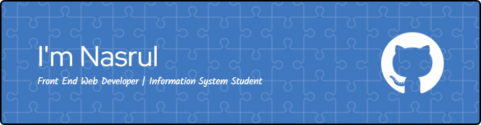

## Hey there!👋

- 🌱  I’m currently learning **Next JS** Framework
- 📖 I'm currently studying at [Merdeka University of Malang](https://unmer.ac.id/)

#### Tech Stack
     
    

#### Stay Connect With Me!

  
  
  

###

  

  

